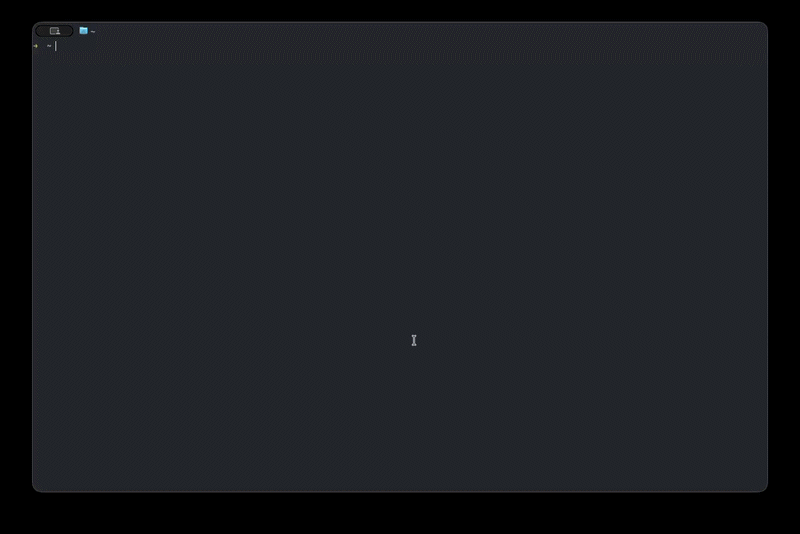

# owl

<!-- VIDÉO — remplacer par la démonstration -->
<p align="center">
  <a href="https://example.com/owl-demo">
    
  </a>
</p>

Un outil en ligne de commande qui affiche les pull requests de votre compte GitHub
dans le terminal, et qui permet de les fusionner en respectant les règles du dépôt.

## Pourquoi

Suivre ses pull requests demande d'ouvrir un navigateur ou d'enchaîner des commandes
`gh` dépôt par dépôt. `owl` regroupe tout dans un seul écran : la liste des PR, leur
état de vérification, leur état de relecture, et la fusion sans quitter le terminal.

## Prérequis

- Rust (édition 2021)
- `gh` installé et connecté (`gh auth login`)

## Installation

```bash
cargo install --path .
```

Ou en local, sans installer :

```bash
cargo run
```

## Utilisation

On lance `owl`, sans argument. La liste des pull requests s'affiche : dépôt, numéro,
âge de la dernière mise à jour, branche visée, titre, état de la CI et des
relectures. Les brouillons et les conflits sont signalés.

L'interface est en anglais.

### Raccourcis

| Touche | Vue liste | Vue détail |
|---|---|---|
| Flèche haut, `k` | sélection précédente | défilement vers le haut |
| Flèche bas, `j` | sélection suivante | défilement vers le bas |
| Flèche droite, `Entrée` | ouvre le détail | — |
| Flèche gauche, `Échap` | — | revient à la liste |
| `m` | ouvre la fenêtre de fusion | ouvre la fenêtre de fusion |
| `r` | rafraîchit | rafraîchit |
| `o` | ouvre la PR dans le navigateur | idem |
| `q`, `Ctrl+C` | quitte | quitte |

La fusion ne propose que les méthodes réellement autorisées par le dépôt. S'il n'y
en a qu'une, `owl` demande seulement confirmation.

La liste se rafraîchit toute seule chaque minute. Quand une PR devient fusionnable,
une notification du système est envoyée — une seule fois, et seulement au moment du
changement.

## Réglages

Fichier optionnel, dans `~/.config/owl/config.toml` :

```toml
filters = ["author:@me", "is:open"]
refresh_interval = 60
preferred_merge_method = "squash"
page_size = 50
```

## Authentification

Le jeton est cherché dans cet ordre : `OWL_TOKEN`, `GITHUB_TOKEN`, puis la sortie de
`gh auth token`. Il n'est jamais écrit dans un fichier, ni journalisé, ni affiché.

## Ce que owl ne fait pas

Créer une pull request, pousser du code, rédiger des commentaires, gérer les issues,
afficher un diff ligne à ligne, fusionner plusieurs PR d'un coup.

## Développement

```bash
cargo build
cargo test
cargo clippy -- -D warnings
cargo fmt --check
```

Le résumé du projet est dans `DESCRIPTION.md`, les spécifications dans
`docs/specs/`.
